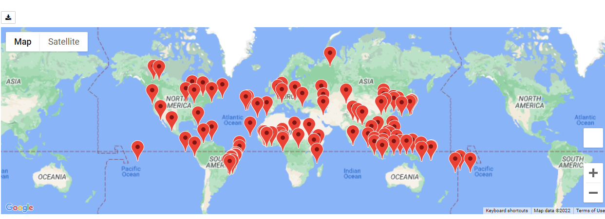

# World_Weather_Analysis
The purpose of this analysis was to set parameters for an ideal vacation based on max and min temperatures, find a list of cities that match the criteria, create a map with those cities, and to plan an itinerary to travel between 4 of those locations as a vacation.

